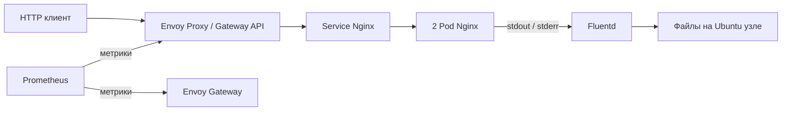

# Демонстрационный DevOps стенд МТС

Решение кейса MTC ENGINEER HACK: веб-приложение в Kubernetes, доступ через Gateway API, метрики Prometheus и сбор логов Fluentd. Проект находится в разработке. Подтверждённый статус указан в [PROJECT_STATUS.md](PROJECT_STATUS.md), история — в [CHANGELOG.md](CHANGELOG.md).

## Архитектура

Планируемая среда: Ubuntu Server 24.04, один узел kubeadm, containerd, Flannel, Envoy Gateway, Nginx, Prometheus и Fluentd. Компоненты и их точные версии будут зафиксированы в конфигурации установки.

## Требования

- Выделенная Ubuntu 24.04 amd64 с sudo и доступом в интернет.
- Рекомендуемые ресурсы: 4 CPU, 8 ГБ RAM, 30 ГБ диска.
- Kubernetes создаётся на этой машине; существующие производственные кластеры не поддерживаются сценарием установки.
- Облачный аккаунт и коммерческий балансировщик не нужны.

## Планируемые команды

После реализации установка будет состоять из `sudo ./bootstrap.sh`, `./deploy.sh` и `./verify.sh`. До появления и проверки этих сценариев команды не являются готовой инструкцией.

## Ограничения

- Один узел: отказ машины останавливает стенд.
- Две копии приложения показывают восстановление Pod, но не устойчивость к отказу узла.
- Логи сохраняются на узле; история Prometheus временная.
- В репозитории не должны находиться ключи, пароли, kubeconfig, ISO и диски ВМ.
- ВМ является средой проверки; экспертам предоставляются конфигурации и инструкции, а не образ ВМ.
