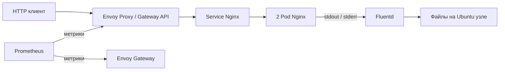

# Демонстрационный DevOps стенд МТС

Nginx в Kubernetes на Ubuntu 24.04. Доступ через Gateway API, метрики в Prometheus, access/error-логи собирает Fluentd. Установка: три shell-сценария и четыре файла манифестов. Результаты проверок — в [PROJECT_STATUS.md](PROJECT_STATUS.md), история — в [CHANGELOG.md](CHANGELOG.md).

## Архитектура



Среда: Ubuntu Server 24.04.4, один узел kubeadm, containerd из репозитория Ubuntu, сеть Flannel. Gateway Controller — Envoy Gateway.

| Компонент | Версия |
| --- | --- |
| Kubernetes / kubeadm / kubelet / kubectl | 1.35.9 |
| containerd на проверенной ВМ | 2.2.1 |
| Helm | 3.18.6 |
| Flannel | 0.28.9 |
| Envoy Gateway | 1.9.2 |
| Gateway API | Поставляется с зафиксированным Helm-chart Envoy Gateway |
| Nginx | 1.28.0-alpine |
| Prometheus | 3.5.0 |
| Fluentd | 1.18.0-debian-1.0 |

Версии закреплены в config/versions.env и манифестах; версии Debian-пакетов сохраняются в `/etc/mts-devops/packages.txt`. Для установки нужны доступные внешние репозитории и registry. Теги образов могут изменяться у издателей.

## Требования

- Выделенная Ubuntu 24.04 amd64 с sudo и доступом в интернет.
- Проверенный стенд: 4 CPU, 4 ГБ RAM, 30 ГБ диска.
- Kubernetes создаётся на этой машине; существующие производственные кластеры не поддерживаются сценарием установки.
- Облачный аккаунт и коммерческий балансировщик не нужны.

## Установка

Для VirtualBox из Windows сначала выполните [подготовку ВМ](docs/virtualbox.md). На выделенной Ubuntu 24.04:

```bash
git clone --branch main https://github.com/Rostyangrib/hakaton-MTS.git
cd hakaton-MTS
sudo ./bootstrap.sh
./deploy.sh
./verify.sh
```

Разработка ведётся в `dev-mts-devops`, итог для сдачи — в `main`. Не выполняйте bootstrap на машине с чужим Kubernetes-кластером. Скрипт отказывается менять кластер без маркера проекта. Повторный запуск установки сохраняет существующий кластер.

Для поэтапной установки и диагностики доступны `./deploy.sh app`, затем `./deploy.sh gateway`, `./deploy.sh monitoring` и `./deploy.sh logging`. Вызов без аргументов устанавливает всё в этом порядке.

bootstrap создаёт кластер и сеть; deploy устанавливает компоненты; verify проверяет маршрут, метрики и доставку логов. Не запускайте несколько verify одновременно: используется локальный порт 19090.

## Проверка компонентов

- HTTP: `curl http://<IP-узла>:30080/`, ожидается `Hello World!` и код 200.
- Gateway API: ресурсы GatewayClass, Gateway, HTTPRoute, EnvoyProxy; входной Service имеет NodePort 30080.
- Prometheus: метрики прокси через `/stats/prometheus`, контроллера через `/metrics`; доступность, число запросов, HTTP-коды и время обработки.
- Fluentd: читает CRI-логи Nginx из `/var/log/containers`, сохраняет JSON в `/var/lib/mts-devops/logs/`.
- Полная проверка и команды диагностики: [docs/verification.md](docs/verification.md).

Метрики: `kubectl -n monitoring port-forward service/prometheus 19090:9090`, затем во втором терминале Ubuntu:

```bash
curl -sG http://127.0.0.1:19090/api/v1/query --data-urlencode 'query=up{job="envoy-proxy"}'
curl -sG http://127.0.0.1:19090/api/v1/query --data-urlencode 'query=sum(envoy_http_downstream_rq_total)'
```

Ожидаются `up=1` и рост счётчика после HTTP-запросов. Собираются также метрики контроллера и самого Prometheus.

Логи: запрос `curl http://<IP-узла>:30080/log-check` создаёт 404 с access/error-записями. Через 10 секунд выполните `kubectl -n logging exec daemonset/fluentd -- sh -c "grep log-check /collected/nginx*.log"`: ожидаются записи со stream stdout и stderr. Файлы сохраняются на диске Ubuntu; позиции чтения и буфер — в `/var/lib/mts-devops/fluentd/`.

## Дополнительные возможности

Две копии Nginx, readiness/liveness, запуск приложения без root с read-only файловой системой, CPU/RAM requests и limits, HTTP-метрики, автоматическая проверка маршрута и собранных access/error-логов.

CI в [.github/workflows/check.yml](.github/workflows/check.yml) запускается на push и pull request: Bash проверяется через bash -n и ShellCheck, YAML — через PyYAML, включая вложенную конфигурацию Prometheus. Результаты доступны во вкладке [Actions](https://github.com/Rostyangrib/hakaton-MTS/actions). Это статические проверки; сквозной тест кластера выполняется командой ./verify.sh на Ubuntu.

verify.sh создаёт десять успешных запросов и один 404, проверяет рост 2xx/4xx и числа измерений latency. Средняя latency выводится в миллисекундах за интервал проверки; в неё может входить фоновый трафик Envoy.

Fluentd работает как root для чтения системных файлов, имеет read-only доступ к `/var/log`, отключённый токен ServiceAccount, запрет повышения привилегий и сброшенные capabilities. Prometheus получает права чтения только Pod в namespace контроллера. kubeconfig пользователя даёт административный доступ к выделенному стенду и не публикуется.

## Отчёт проверки

Среда: Ubuntu 24.04.4, VirtualBox, 4 vCPU / 4 ГБ RAM. Результаты ниже относятся к указанным датам, а не к постоянному мониторингу стенда.

| Сценарий | Дата | Результат |
| --- | --- | --- |
| Установка из clean-ubuntu | 02.10.2026 | clone → bootstrap → deploy → verify, код 0; HTTP-счётчик 23 → 40 |
| Повторные bootstrap и deploy | 02.10.2026 | Кластер сохранён, verify прошёл; счётчик 193 → 210 |
| Удаление Nginx Pod | 02.10.2026 | Восстановлены 2 реплики; verify прошёл, счётчик 215 → 232 |
| Перезагрузка ВМ | 02.10.2026 | Компоненты восстановились; verify прошёл, счётчик 245 → 262 |
| Расширенная проверка HTTP-метрик | 03.10.2026 | verify прошёл: 2xx 3 → 16, 4xx 0 → 1, latency samples 8 → 25; среднее 1,81 мс |

Пример завершающих строк проверки с чистого снимка:

```text
PASS: Gateway HTTP 200 and Hello World!
PASS: Prometheus targets UP; HTTP counter 23 -> 40
PASS: Fluentd collected access and error records for check-1790940896-13785
PASS: All mandatory component checks passed.
```

## Ограничения

- Один узел: отказ машины останавливает стенд.
- Две копии приложения показывают восстановление Pod, но не устойчивость к отказу узла.
- Логи сохраняются на узле; история Prometheus временная.
- В репозитории не должны находиться ключи, пароли, kubeconfig, ISO и диски ВМ.
- ВМ является средой проверки; экспертам предоставляются конфигурации и инструкции, а не образ ВМ.
