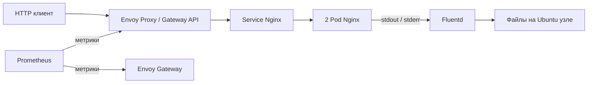

# Демонстрационный DevOps стенд МТС

Решение кейса MTC ENGINEER HACK: веб-приложение в Kubernetes, доступ через Gateway API, метрики Prometheus и сбор логов Fluentd. Проект находится в разработке. Подтверждённый статус указан в [PROJECT_STATUS.md](PROJECT_STATUS.md), история — в [CHANGELOG.md](CHANGELOG.md).

## Архитектура



Среда: Ubuntu Server 24.04, один узел kubeadm, containerd из репозитория Ubuntu, Flannel, Envoy Gateway, Nginx, Prometheus и Fluentd. Функциональные проверки пока не завершены — актуальный статус указан отдельно.

| Компонент | Версия |
| --- | --- |
| Kubernetes / kubeadm / kubelet / kubectl | 1.35.9 |
| Helm | 3.18.6 |
| Flannel | 0.28.9 |
| Envoy Gateway | 1.9.2 |
| Gateway API | Поставляется с зафиксированным Helm-chart Envoy Gateway |
| Nginx | 1.28.0-alpine |
| Prometheus | 3.5.0 |
| Fluentd | 1.18.0-debian-1.0 |

Версии установленных Debian-пакетов, включая containerd, bootstrap сохраняет в `/etc/mts-devops/packages.txt`. Установка пакетов Ubuntu использует актуальный репозиторий ОС; это зависимость от доступности репозитория. Образы имеют фиксированные теги; побитовая неизменность тегов внешнего registry не гарантируется.

## Требования

- Выделенная Ubuntu 24.04 amd64 с sudo и доступом в интернет.
- Для компактного стенда: 4 CPU, 4 ГБ RAM, 30 ГБ диска; 8 ГБ RAM дают дополнительный запас. Проверка в ВМ с 4 ГБ RAM пока не завершена.
- Kubernetes создаётся на этой машине; существующие производственные кластеры не поддерживаются сценарием установки.
- Облачный аккаунт и коммерческий балансировщик не нужны.

## Установка

Для VirtualBox из Windows сначала выполните [подготовку ВМ](docs/virtualbox.md). На выделенной Ubuntu 24.04:

```bash
git clone --branch dev-mts-devops https://github.com/Rostyangrib/hakaton-MTS.git
cd hakaton-MTS
sudo ./bootstrap.sh
./deploy.sh
./verify.sh
```

На этапе разработки используется `dev-mts-devops`; перед сдачей проверенный результат должен находиться в `main`, а инструкция переключается на неё. Не выполняйте bootstrap на машине с чужим Kubernetes-кластером. Скрипт отказывается менять кластер без маркера проекта. Повторный запуск установки сохраняет существующий кластер.

Для поэтапной установки и диагностики доступны `./deploy.sh app`, затем `./deploy.sh gateway`, `./deploy.sh monitoring` и `./deploy.sh logging`. Вызов без аргументов устанавливает всё в этом порядке.

Сценарии подготовлены; успешность полной установки должна подтверждаться результатами [проверки](docs/verification.md), а не только наличием файлов.

## Проверка компонентов

- HTTP: `curl http://<IP-узла>:30080/`, ожидается `Hello World!` и код 200.
- Gateway API: ресурсы GatewayClass, Gateway, HTTPRoute, EnvoyProxy; входной Service имеет NodePort 30080.
- Prometheus: метрики прокси через `/stats/prometheus`, контроллера через `/metrics`; доступность, число запросов, HTTP-коды и время обработки.
- Fluentd: читает CRI-логи Nginx из `/var/log/containers`, сохраняет JSON в `/var/lib/mts-devops/logs/`.
- Полная проверка и команды диагностики: [docs/verification.md](docs/verification.md).

## Дополнительные возможности

Две копии Nginx, readiness/liveness, запуск приложения без root с read-only файловой системой, CPU/RAM requests и limits, HTTP-метрики, автоматическая проверка маршрута и собранных access/error-логов. Это заявленный состав конфигураций; подтверждённые проверки перечисляются в статусе проекта.

Fluentd работает как root для чтения системных файлов, имеет read-only доступ к `/var/log`, отключённый токен ServiceAccount, запрет повышения привилегий и сброшенные capabilities. Prometheus получает права чтения только Pod в namespace контроллера. kubeconfig пользователя даёт административный доступ к выделенному стенду и не публикуется.

## Ограничения

- Один узел: отказ машины останавливает стенд.
- Две копии приложения показывают восстановление Pod, но не устойчивость к отказу узла.
- Логи сохраняются на узле; история Prometheus временная.
- В репозитории не должны находиться ключи, пароли, kubeconfig, ISO и диски ВМ.
- ВМ является средой проверки; экспертам предоставляются конфигурации и инструкции, а не образ ВМ.
